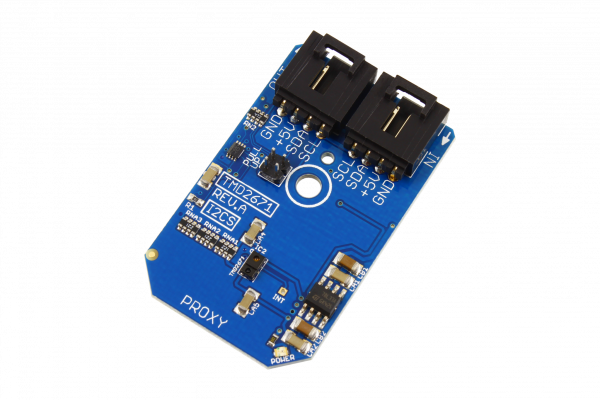

# TMD2671

The TMD2671 is a digital proximity detector that includes an integrated LED driver and IR LED.The proximity detector in this device operates from sunlight to dark rooms and is calibrated to 100-mm.The addition of the micro-optics lenses to the TMD2671 provides highly efficient transmission and reception of IR energy.
This Device is available from www.ncd.io 

[SKU: TMD2671_I2CS]

(https://store.ncd.io/product/tmd2671-infrared-digital-proximity-detector-i2c-mini-module/)
This Sample code can be used with Arduino.

Hardware needed to interface TMD2671 sensor with Arduino

1. <a href="https://store.ncd.io/product/i2c-shield-for-arduino-nano/">Arduino Nano</a>

2. <a href="https://store.ncd.io/product/i2c-shield-for-arduino-micro-with-i2c-expansion-port/">Arduino Micro</a>

3. <a href="https://store.ncd.io/product/i2c-shield-for-arduino-uno/">Arduino uno</a>

4. <a href="https://store.ncd.io/product/dual-i2c-shield-for-arduino-due-with-modular-communications-interface/">Arduino Due</a>

5. <a href="https://store.ncd.io/product/tmd2671-infrared-digital-proximity-detector-i2c-mini-module/">TMD2671 Infrared Digital Proximity Detector Sensor</a>

6. <a href="https://store.ncd.io/product/i%C2%B2c-cable/">I2C Cable</a>

TMD2671:

The TMD2671 is a digital proximity detector that includes an integrated LED driver and IR LED.The proximity detector in this device operates from sunlight to dark rooms and is calibrated to 100-mm.The addition of the micro-optics lenses to the TMD2671 provides highly efficient transmission and reception of IR energy.

Applications:

• Mobile Handset Touchscreen Control and Automatic Speakerphone Enable

• Mechanical Switch Replacement

• Paper Alignment

• Digital Signage

How to Use the TMD2671 Arduino Library

The TMD2671 has a number of settings, which can be configured based on user requirements.
          
1.Accessing time setting:The following command is used to set the accessing time of TMD2671 sensor.

             tmd.setATime(ATIME_2_72MS);                 // Cycles: 1, Time: 2.72 ms
         
 2.Proximity Interrupt time:The following command is used to set the Proximity Interrupt time.
 
             tmd.setPTime(PTIME_2_72MS);                 // Cycles: 1, Time: 2.72 ms Max Count: 1023
            
3.Wait time:The following command is used to set the wait time for sensor.

             tmd.setWTime(WTIME_1);                      // Wait Time: 1, Time (WLONG = 0): 2.72 ms Time (WLONG = 1):  0.032 sec
           
4.Proximity drive:The following command is used to set the proximity drive.

             tmd.setProximityDrive(PDRIVE_100);          // LED Strength – PDL=0: 100%
           
5.Proximity diode selection:The following command is used for the selection of diode.             
           
             tmd.setProximityDiode(PDIODE_CH1);          // Proximity Uses the CH1 Diode
             
